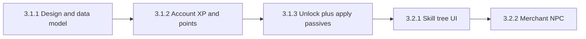

# Skill Tree & Account XP — Implementation Plan

This document ties together the course tasks (3.1.x, 3.2.x), maps them to this Unity project, and suggests an **order of work** you can follow from design through lobby merchant integration.

---

## How this fits your current game

| Concept | Already in project | Notes |
|--------|---------------------|--------|
| **Run XP / run level** | [`Assets/Scripts/Player/PlayerXP.cs`](Assets/Scripts/Player/PlayerXP.cs) | XP from orbs; level-up opens **in-run** upgrade cards. **Do not reuse** for account progression. |
| **In-run upgrades** | [`UpgradeCatalogue`](Assets/Scripts/Upgrades/UpgradeData.cs), [`UpgradeManager`](Assets/Scripts/Upgrades/UpgradeManager.cs) | Resets each run. Meta passives should be applied **separately** (e.g. on run start), not folded into `UpgradeManager.Apply`. |
| **Waves** | [`WaveManager`](Assets/Scripts/Waves/WaveManager.cs) | `OnWaveCleared` is a natural hook for **meta XP** when you add account progression. |
| **Persistence** | [`HighScoreManager`](Assets/Scripts/Managers/HighScoreManager.cs) (`PlayerPrefs`) | Pattern to mirror for account XP, level, unlocked nodes, spent points. |
| **Lobby** | Lobby level root, [`LobbyPortalManager`](Assets/Scripts/LobbyPortalManager.cs), etc. | Where skill UI + merchant NPC will live. |

---

## Task 3.1.1 — Skill tree design (data + layout)

**Goal:** Lock down *what* exists before you code unlock logic or UI.

### Deliverables

1. **Node list** — Each row should have at least:
   - **Stable ID** (string, e.g. `meta_strike_1`) — never rename once saves exist.
   - **Display name** & **short description** (for tooltips later).
   - **Effect type**: small permanent stat vs capstone (unique rule).
   - **Numbers** (e.g. +4% damage, +12 max HP) — tune later, but decide *category*.
2. **Dependencies** — Recommended model for clarity:
   - **Linear tracks**: each node has **`previousNodeId`** (or null for the first node in a track). Player unlocks in order along that path.
   - **Multiple tracks** (e.g. Striker / Survivor / Skirmisher) can exist in parallel; no cross-links until you add a late “keystone.”
3. **Data representation** — Pick one for v1:
   - **ScriptableObjects** — one asset per node, or one “catalogue” asset listing all nodes; good for designers, easy references in Unity.
   - **Static C# list** (e.g. `SkillTreeCatalogue.All`) — fastest to ship; migrate to SO/JSON later.
   - **JSON** — good for modding or external tools; more work for load/save and validation.

**Depends on:** Nothing (pure design).

**Estimated time:** 4–6 hours (spreadsheet + short spec is enough for v1).

---

## Task 3.1.2 — Account XP and skill points system

**Goal:** Meta progression that persists between sessions, independent of run XP.

### Behaviour

- **Account XP** — Separate integer/float from `PlayerXP`. Increases from agreed sources (e.g. wave clears, boss kills, tutorial milestones).
- **Account level** — Derived from XP curve (e.g. linear threshold per level for testing: 500 XP per level).
- **Skill points** — Grant **1 point per account level** (or configurable). Track **unspent** points.
- **Persistence** — `PlayerPrefs` keys (namespaced, e.g. `CS4483_AccountXP`) or a small JSON file under `Application.persistentDataPath` if you outgrow prefs.

### Suggested implementation sketch

- New singleton or static service: **`AccountProgression`** (or `MetaProgression`).
- API surface (minimal):
  - `void AddAccountXP(int amount)`
  - `bool TrySpendSkillPoint(string nodeId)` → validates prereqs + cost, saves.
  - `IReadOnlyList<string> UnlockedNodeIds` / `bool IsUnlocked(string id)`
  - Load/save in `Awake` or explicit `Initialize()`.

### XP sources (choose and document)

| Source | Pros | Notes |
|--------|------|--------|
| Wave cleared | Matches your task wording; scales with progress | Subscribe to `WaveManager.OnWaveCleared`; use `waveIndex` in formula. |
| Boss defeated | Extra reward | Hook boss death / wave manager boss flag. |
| One-time | Tutorial complete | Optional. |

**Depends on:** 3.1.1 (at least node IDs and costs so you know what “unlock” means). You can stub nodes and still implement XP/level/points.

**Estimated time:** 5–7 hours.

---

## Task 3.1.3 — Skill tree unlock + apply passives

**Goal:** Spending a point does something in gameplay; starting a run applies cumulative bonuses.

### Unlock logic

- **`CanUnlock(nodeId)`** — Has unspent point(s); `previousNodeId` is unlocked (if any); optional **min account level**; node not already unlocked.
- **`Unlock(nodeId)`** — Deduct point, add ID to unlocked set, save.

### Apply passives (critical separation from run upgrades)

- **When:** Once per run, when the player is ready to play — e.g. after entering arena from lobby, or when `GameManager` sets state to Playing and player spawns.
- **How:**
  - **Stat nodes:** Sum flat/% bonuses and apply to **base** stats on `PlayerHealth`, `PlayerWeapon`, `PlayerController` (order: read meta modifiers → set effective base before run upgrades, or apply meta as a separate multiplier layer — **document one rule** and stick to it).
  - **Capstones:** Small components on the player or managers, e.g. `OpeningStrikeTracker`, `SecondWindPassive`, read enabled flags from `AccountProgression`.

### Files you will likely touch

- [`GameManager`](Assets/Scripts/Managers/GameManager.cs) — orchestrate “apply meta” once per run.
- [`PlayerHealth`](Assets/Scripts/Player/PlayerHealth.cs), [`PlayerWeapon`](Assets/Scripts/Player/PlayerWeapon.cs), [`PlayerController`](Assets/Scripts/Player/PlayerController.cs) — expose safe setters or an `ApplyMetaModifiers` method.

**Depends on:** 3.1.1, 3.1.2.

**Estimated time:** 6–10 hours (scales with number of unique capstone behaviors).

---

## Task 3.2.1 — Skill tree UI (lobby)

**Goal:** Player can see the tree, understand costs, and spend points without debug menus.

### Features (v1)

- **Static layout** — Buttons or images placed in a panel (no dynamic graph layout required at first).
- **Per node:** Name, description tooltip, cost (usually 1), **locked / unlockable / unlocked** visual states.
- **Input:** Mouse click on node → if unlockable, call `AccountProgression.TryUnlock` and refresh UI.

### Unity pieces

- Canvas under lobby or overlay (reuse patterns from [`UpgradeUI`](Assets/Scripts/UI/UpgradeUI.cs): pause not required in lobby).
- Optional: second canvas or panel only visible when merchant opens tree.

**Depends on:** 3.1.1 (definitions), 3.1.2 (points + unlock API).

**Estimated time:** 8–12 hours.

---

## Task 3.2.2 — Lobby merchant interaction

**Goal:** Diegetic entry point into the skill tree.

### Behaviour

- **NPC** in lobby with a trigger collider or proximity check.
- **Prompt** — “Press E to open skills” (or your existing interact pattern).
- **On interact:** Enable skill tree panel; show **account level**, **XP bar toward next level**, **unspent skill points** (read from `AccountProgression`).

**Depends on:** 3.2.1; lobby scene with a place for the NPC (your “4.1.1 Lobby built” task).

**Estimated time:** 4–6 hours.

---

## Recommended implementation order

1. **3.1.1** — Minimal node table + dependency rule + choice of ScriptableObject vs code catalogue.
2. **3.1.2** — `AccountProgression` + XP + levels + points + save; test with **Debug.Log** or a temporary editor/menu button.
3. **3.1.3** — Unlock validation + apply at run start; verify in arena with one real node.
4. **3.2.1** — Lobby UI wired to the same API.
5. **3.2.2** — Merchant opens that UI.

**Parallel track:** You can draft **tooltips and art** for 3.2.1 while coding 3.1.2 if the node list from 3.1.1 is stable.

---

## Testing checklist

- [ ] New install: 0 XP, level 1, 0 unlocks; no errors on first run.
- [ ] Add XP via debug → level up → skill point increments.
- [ ] Unlock node with prereq blocked until previous node purchased.
- [ ] Restart game: unlocks and XP persist (`PlayerPrefs` / save file).
- [ ] Start arena: passive stats match unlocked nodes; run upgrades still work independently.
- [ ] Merchant opens UI; spending point updates UI and save.

---

## Risk notes

- **Balance:** Keep early meta nodes **small** so they don’t obsolete in-run cards; capstones can use cooldowns / once-per-run rules.
- **Scene references:** After adding UI, run your usual **Full Setup** or save scenes so prefabs/scene don’t reference missing objects.
- **Scope creep:** Ship **one full track** (e.g. damage → one capstone) end-to-end before adding three parallel tracks.

---

## Related files in this repo (reference only)

- Run XP: `Assets/Scripts/Player/PlayerXP.cs`
- Upgrades: `Assets/Scripts/Upgrades/UpgradeData.cs`, `UpgradeManager.cs`
- Waves: `Assets/Scripts/Waves/WaveManager.cs`
- Persistence example: `Assets/Scripts/Managers/HighScoreManager.cs`
- Lobby flow: `Assets/Scripts/LobbyPortalManager.cs`, `Assets/Scripts/Managers/GameManager.cs`

This plan is the single place to align **design tasks**, **engineering tasks**, and **test criteria** for the skill tree milestone.
